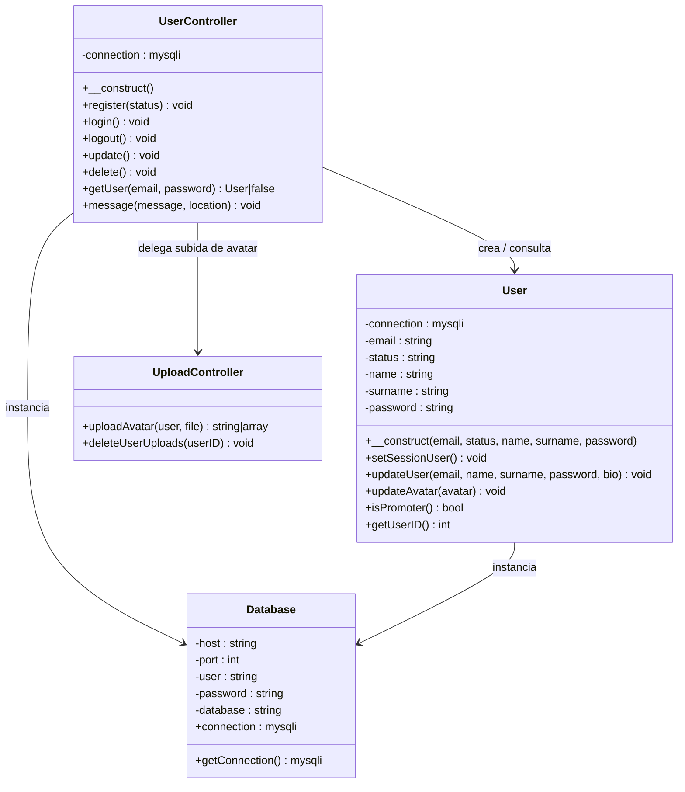
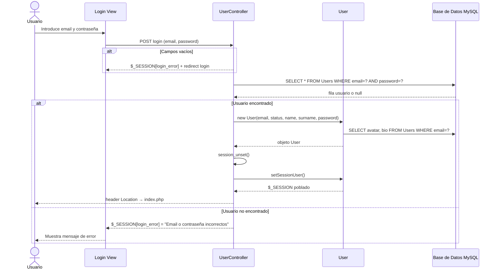
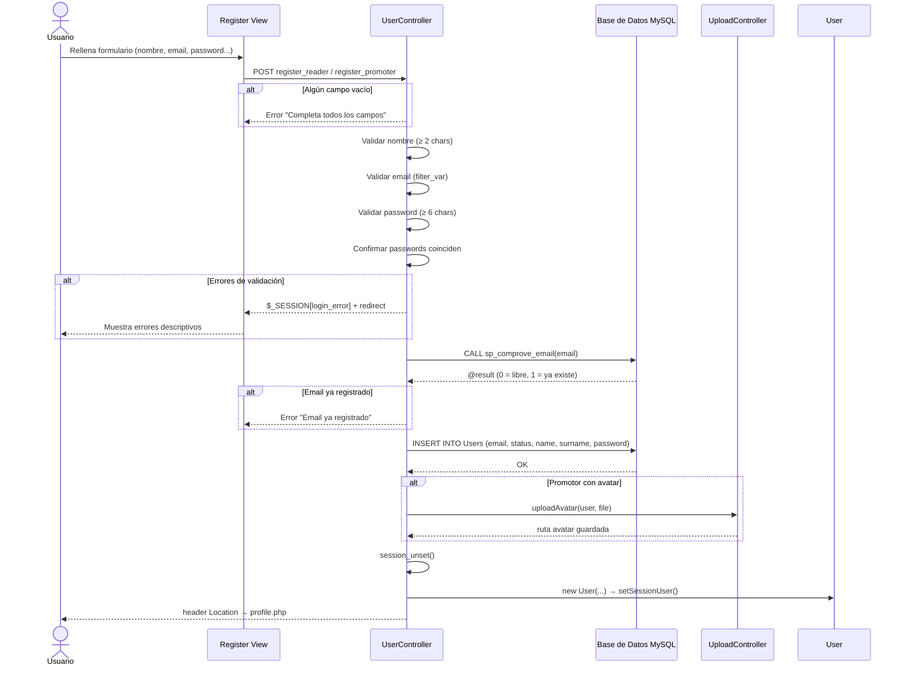
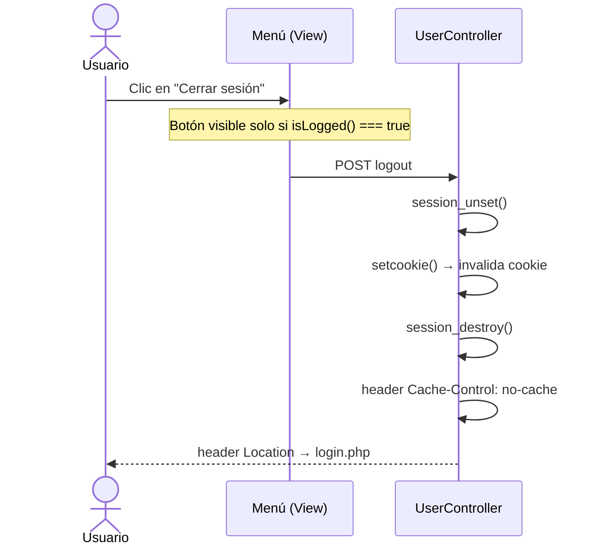

# Monogatarya – Práctica 5: Login, Registro y Logout con MySQLi

## Introducción

**Monogatarya** es una aplicación web de gestión de contenido manga/anime desarrollada en PHP con arquitectura MVC. Esta práctica implementa el sistema de autenticación completo (login, registro y logout) conectando los formularios con una base de datos MySQL mediante **MySQLi orientado a objetos**.

Existen dos tipos de usuario:
- **Lector** (`reader`): usuario estándar que puede explorar catálogos y gestionar su perfil.
- **Promotor** (`promoter`): usuario administrador con acceso a funcionalidades adicionales como subir imágenes de perfil, gestionar obras y eventos.

---

## Funcionalidades

### Login (RF1)
- Formulario único de login para ambos tipos de usuario (`login.php`).
- Verificación de email y contraseña contra la base de datos.
- Redirección al perfil (`profile.php`) si las credenciales son correctas.
- Mensaje de error descriptivo si los datos son incorrectos.
- Protección de páginas privadas mediante `requireLogin()` y `requireRole()`.
- El promotor accede a funcionalidades exclusivas (creación de obras, eventos, subida de avatar).
- El lector accede únicamente a catálogos y su perfil básico.

### Registro (RF2)
- Formulario de registro independiente por tipo de usuario:
  - `register-reader.php` → lector (status = 0)
  - `register-promoter.php` → promotor (status = 1)
- Alta del usuario en la base de datos con los datos del formulario.
- Redirección a `index.php` si el registro es correcto.
- Mensajes de error descriptivos si la validación falla (nombre, email, contraseña, confirmación).
- El promotor puede subir una imagen de avatar durante el registro/edición de perfil.

### Logout (RF3)
- Botón de cerrar sesión visible únicamente si el usuario está logueado (función `isLogged()`).
- Limpieza de variables de sesión con `session_unset()` y destrucción con `session_destroy()`.
- Invalidación de la cookie de sesión.
- Redirección automática a `login.php`.

### Requisitos no funcionales (RNF4)
- Toda la información se almacena y lee desde MySQL.
- Se usa **MySQLi orientado a objetos** (`new mysqli(...)`).
- Estructura de carpetas **MVC**: `model/`, `view/`, `controller/`, `core/`.
- Clase `UserController` con los métodos `login()`, `logout()` y `register()`.
- Validación de al menos dos campos en servidor: formato de email (`filter_var`) y longitud mínima de contraseña (≥ 6 caracteres).

---

## Cómo funciona

### Estructura de carpetas

```
DAM-Transversal/
├── controller/
│   ├── UserController.php      # Lógica de autenticación
│   ├── CatalogController.php
│   └── UploadController.php
├── core/
│   ├── config.php              # Constantes de rutas y URLs
│   ├── database.php            # Clase Database (MySQLi OO)
│   └── auth.php                # Funciones de control de sesión
├── model/
│   ├── User.php                # Clase User
│   ├── Chapters.php
│   ├── Events.php
│   └── Monogatarya_BD.sql      # Script SQL de la base de datos
└── view/
    ├── auth/
    │   ├── login.php
    │   ├── register.html
    │   ├── register-reader.php
    │   └── register-promoter.php
    ├── catalogs/
    ├── includes/
    │   ├── header.php
    │   ├── menu.php            # Botón logout condicional
    │   └── footer.php
    ├── profile.php
    └── index.php
```

---

### Diagrama de Clases – User



---

### Diagrama de Secuencia – Login



---

### Diagrama de Secuencia – Registro



---

### Diagrama de Secuencia – Logout



---

## Instalación y uso

1. Importar la base de datos: ejecutar `model/Monogatarya_BD.sql` en MySQL.
2. Configurar credenciales de conexión en `core/database.php` si es necesario.
3. Desplegar en servidor local (XAMPP / Apache) en la ruta `/DAM-Transversal/`.
4. Acceder a `view/auth/login.php` para iniciar sesión.
5. Desde `view/auth/register.html` elegir el tipo de usuario para registrarse.
6. El botón **Cerrar sesión** aparece en el menú lateral solo cuando hay sesión activa.

---

## Notas técnicas

| Aspecto | Detalle |
|---|---|
| Lenguaje | PHP 8+ |
| Base de datos | MySQL con MySQLi Object-Oriented |
| Sesiones | `$_SESSION` gestionadas en `UserController` y `User` |
| Control de acceso | `auth.php` → `requireLogin()`, `requireRole()`, `isLogged()` |
| Validaciones servidor | email (`filter_var`), password (≥6 chars), nombre (≥2 chars) |
| Subida de imágenes | Solo promotores, gestionada por `UploadController` |
| Stored procedures | `sp_comprove_email`, `sp_update_user` |